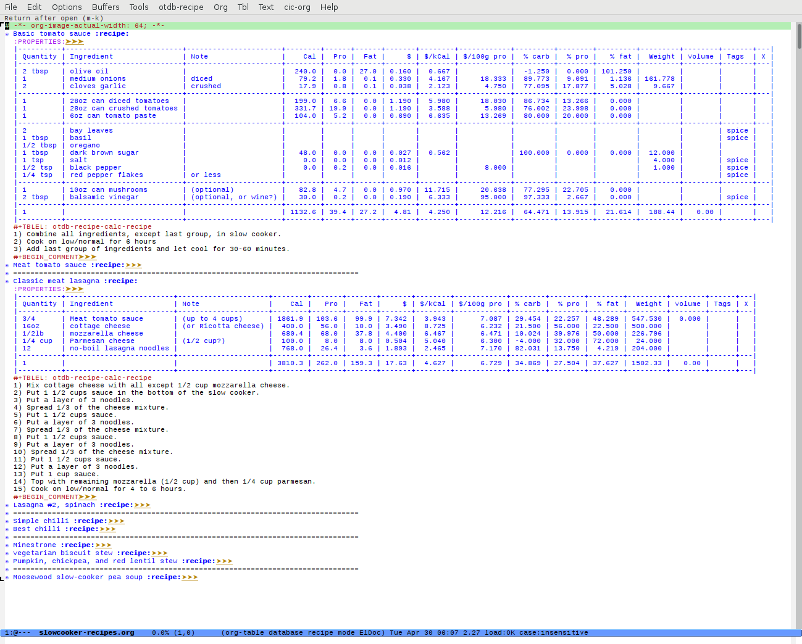
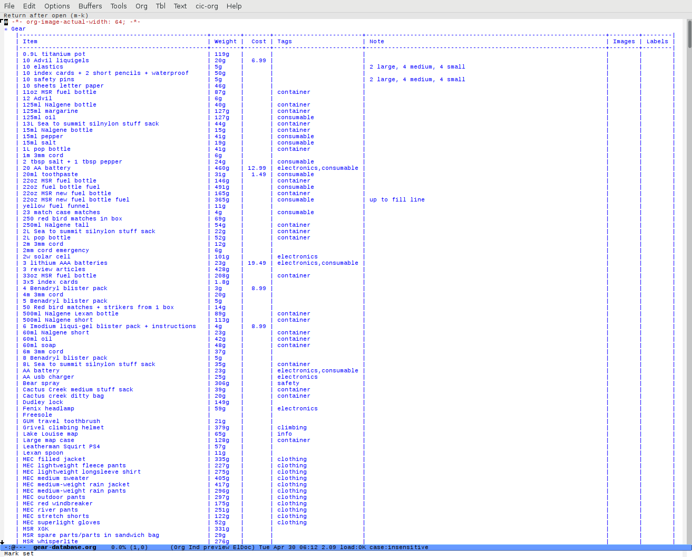

otdb: org-table Database
========================

This package uses Emacs `org-mode` tables to store relatively small
amounts of user-collected data and perform the calculations
required. The two current applications manage detailed ingredient
lists for recipes (the cooking variety) and equipment lists for
backpacking trips.

The motivation for the recipe application was the frustration of not
being able to calculate useful cost and nutritional information for
home cooked food. With this application, up to several dozen
variations on a menu plan are easily compared and matched to current
needs.

The motivation for the backpacking gear application arose from the
frustration of too many trips with overweight and/or under-equipped
backpacking loads.  Up to several dozen variations on a pack load are
easily examined.

Requirements
============

This package requires a standard Emacs installation, of course. It has
mostly been tested with the current Emacs package on Debian Linux
(Jessie) and should not require any other packages from the Debian
package manager.  The associated library from
[http://github.com/akroshko/emacs-stdlib](http://github.com/akroshko/emacs-stdlib)
is the only additional Emacs requirement.  The `git` version control
system is an optional requirement to using the installation
instructions below.

Installation
============

The library from
[http://github.com/akroshko/emacs-stdlib](http://github.com/akroshko/emacs-stdlib)
can be installed using the command `git clone
https://github.com/akroshko/emacs-stdlib.git ../emacs-stdlib` so by
default it is in a sibling directory of this package.

Basic usage
===========

The
[backpacking-recipes](http://github.com/akroshko/emacs-otdb/backpacking-recipes/),
[gear](http://github.com/akroshko/emacs-otdb/gear/), and
[recipes](http://github.com/akroshko/emacs-otdb/recipes/) directories
contain some sample database files, recipes, and gear collections.
Launch Emacs with the command `emacs -q --load otdb-sample-init.el` to
try this package out.  Ensure the aforementioned
[emacs-stdlib](http://github.com/akroshko/emacs-stdlib) library is at
`../emacs-stdlib/`, or modify the
[otdb-sample-init.el](http://github.com/akroshko/emacs-otdb/otdb-sample-init.el)
file accordingly.

Go to any of the previously mentioned directories, open a `.org` file
that does not contain `-database` in the name.  Use
`otdb-table-recalculate` (`s-d *`) to lookup in the database and
recalculate, where `s-` is the super key.  If the super key is not
defined for a particular system, then remap the keys in
`otdb-tables.el` or call the appropriate commands using `M-x`.  Use
one, two, or three `C-u` prefixes with `otdb-table-recalculate` (`s-d
*`) to respectively recalculate for the current file, current
directory, or current directory three times.

New table rows recipes or gear collections are added manually for now
but the names of ingredients/items/recipes/gear collections can be inserted
with `otdb-table-goto-key-in-database` (`s-d d`).

The ingredient at point (for recipes) can be added into an `org-mode`
agenda under the headings starting with `* Groceries`; which is a very
useful but limited feature for now.  Using
`otdb-recipe-agenda-push-groceries` (`s-d +`) copies checked items to
a `-groceries.org` file (specific to application) that can be used
with the `org-mobile` package.

The recipe at point can be exported with `M-x otdb-recipe-export` and
a set of recipes in a table can be exported with `M-x
otdb-recipe-export-multiple`.  There are no default key sequences to
perform export yet.

Complete Description
====================

### Recipes

The food database stores ingredients in an `org-mode` table, and
includes cost, calories, and macro-nutrient information.  The recipes
themselves are also specified by `org-mode` tables with one ingredient
or a component recipe (a recipe used within the current recipe) on
each table row.  A single key sequence then queries both the cost and
nutritional values in the food database and performs the necessary
calculations.  Nested recipes allow, e.g., the cost/nutritional value
of part of a tomato sauce recipe to be used in a lasagna recipe.  This
can easily be expanded into full menu plans based solely on data about
the individual ingredients. Even when cooking completely from scratch
with a partially complete database, many different tradeoffs
concerning cost/calories/etc. can be readily examined .

##### Screenshots

### Backpacking gear

The backpacking gear database stores individual items in an `org-mode`
table, and includes the weight and cost of purchase.  The gear
collections themselves (equivalent to the recipes above) are also
specified by `org-mode` tables with one item or a gear collection
(nested like the component recipes above) on each table row. A single
key sequence then queries both the weight and cost values in the
database and performs the necessary calculations.  Nested gear
collections allow easy comparisons of substituted gear collections,
e.g., different first-aid/repair/kitchen kits, in order to quantify
any tradeoffs.  This can be easily extended into large nested
collections of gear based solely on data about the individual items.

##### Screenshots

Detailed purpose
----------------

This package demonstrates how software development tools such as
Emacs, which allow for extremely efficient editing of text, might
enhance the management of relatively small amounts of data and
simplify the tedious calculations associated with the above-mentioned
applications.

By providing quantified information about the targeted activities,
this package constitutes an investigation into the benefits and
limitations of having available extensive information and results of
calculations.  Although there is nothing unique about the type and
quantity of calculations performed, it can be difficult to incorporate
these calculations, using personalized data, into such customized
activities using the available tools.  With this package, it has been
found to be relatively easy to keep a personalized database updated
with the costs/weights/nutritional information for food and the
weights/costs for backpacking gear.  In particular, this package has
helped a great deal with adapting to last-minute or changing
situations, e.g., last minute trip or budget changes.

There is much room for improvement and this package could be extended
to help with the data and calculations for many other uses.  Although
some spreadsheets and web applications can offer similar
functionality, for users skilled in text editing using Emacs this
package provides a very unique and useful option.

Planned Development
===================

- a special function to use instead of `TBLFM: ` to speed up
  recalculation of the recipe tables

- templates/keys to create a recipe/collection and to insert a line

- more profiling to speed up the package overall

- export to nicely formatted .html

- export gear collections and checklists

- improve export to .pdf, collections of recipes with one recipe per page

- export to .pdf for mobile devices or hardcopy in a way that will
  convienient while travelling

- more complete agenda integration with better testing

- ability to generate a complete list of ingredients/items from nested
  recipes/gear collections

- give a range of values when optional ingredients are included or
  excluded

- more convenient ways to query recipes/gear collections for
  tablet/laptop/mobile

- more complete examples that demonstrate the usefulness of this
  package for specific situations
